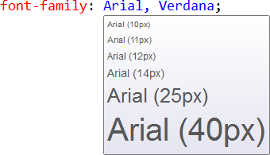
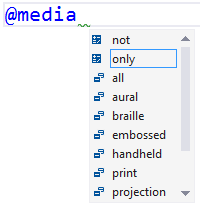

# CSS Tools

Download this extension from the [VS Marketplace](https://marketplace.visualstudio.com/vsgallery/a2b0e9a8-85c6-4495-8578-dc1da0a8791c)
or get the [CI build](http://vsixgallery.com/extension/0020efc9-e999-4e6f-a2b6-604127f480bc/).

---------------------------------------

Provides additional features to the CSS editor in Visual Studio.

See the [change log](CHANGELOG.md) for changes and road map.

## Features

- Color adornments
- Image and font preview
- Selector specificity tooltip
- Drag 'n drop of font files
- Darken/lighten hex colors
- Vendor property synchronization
- Media query Intellisense powered by Browser Link

### Color adornments
All color types are supported, including the new CSS 3 formats.

### Image and font preview

### Darken/lighten hex colors
Place the caret on a hex color value and hit **Ctrl+Shift+Up/Down** to
darken or lighten the color value.

The same can be done with any number value such as `1.2px` to increase
or decrease the value.

### Vendor property synchronization

### Media query Intellisense

## Contribute
Check out the [contribution guidelines](.github/CONTRIBUTING.md)
if you want to contribute to this project.

For cloning and building this project yourself, make sure
to install the
[Extensibility Tools 2015](https://visualstudiogallery.msdn.microsoft.com/ab39a092-1343-46e2-b0f1-6a3f91155aa6)
extension for Visual Studio which enables some features
used by this project.

## License
[Apache 2.0](LICENSE)